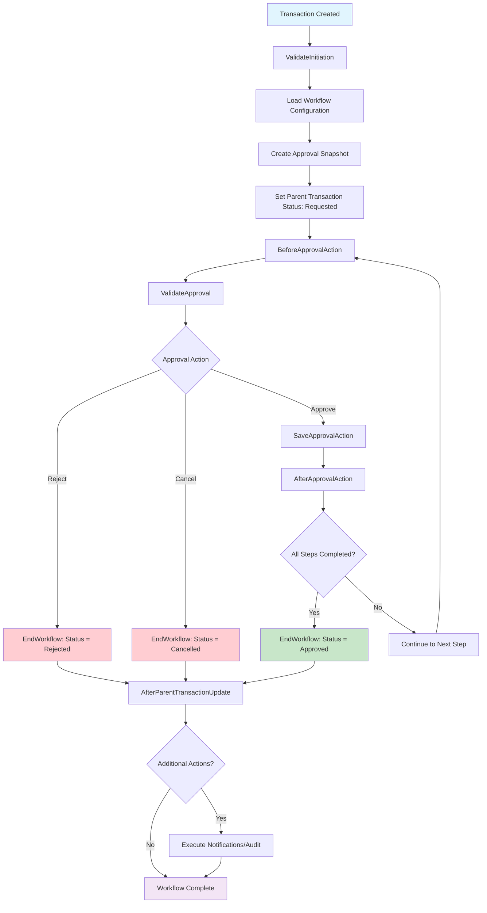

# Approval Workflow Engine — Architecture Documentation

## Overview

The Approval Engine orchestrates transaction approval workflows, ensuring consistency, security, and auditability. It delegates core operations to `ApprovalWorkflowBase` and provides lifecycle hooks for module-specific customization.

## Design Goals

- **Consistency**: Centralize approval orchestration logic.
- **Extensibility**: Enable customization through pre/post hooks.
- **Auditability**: Track all state transitions for auditing.
- **Maintainability**: Keep engine logic cohesive with flexible module extensions.

## Core Components

### 1. ApprovalEngine<TApprovalRecord, TApprovalContext>

Orchestrates the approval workflow lifecycle:
- Initiation
- Approval, rejection, or cancellation
- Finalization
- Post-update notifications

**Lifecycle Hooks**:

| Hook                        | When It Runs                                  | Purpose                                    |
|-----------------------------|-----------------------------------------------|--------------------------------------------|
| `BeforeApprovalAction`      | Before processing approval or rejection        | Validate or transform the request          |
| `AfterApprovalAction`       | After saving approval or rejection            | Log or trigger domain-level side effects   |
| `AfterParentTransactionUpdate` | After updating parent transaction status    | Send notifications or audit logs           |

Hooks are `protected virtual`, allowing derived classes to override them safely.

### 2. ApprovalWorkflowBase<TApprovalRecord, TApprovalContext>

Abstract base class for module-specific persistence and validation.

| Method                        | Responsibility                                      |
|-------------------------------|----------------------------------------------------|
| `ValidateInitiation`          | Validate before creating approval records          |
| `ValidateApproval`            | Verify approval eligibility and constraints        |
| `SaveApprovalAction`          | Persist approval record updates                    |
| `UpdateParentTransactionStatus` | Update parent transaction status                  |
| `AfterParentTransactionUpdate` | Handle post-update tasks (e.g., notifications)     |

### 3. IApprovalWorkflowConfigManager

Retrieves workflow configuration based on:
- TransactionTypeId
- FacilityLeId
- CurrencyTypeId
- BusinessModelTypeId
- Amount

**Method**:  
`IEnumerable<ApprovalWorkflowConfigEntity> GetWorkflowForTransaction(ApprovalWorkflowSearchCriteria criteria)`

## Workflow Lifecycle

The workflow diagram below reflects the engine’s lifecycle, with `EndWorkflow` explicitly shown for clarity.

I’ll create a clean, well-structured Markdown file based on the provided content, focusing on fixing formatting issues (e.g., the empty table placeholders for Status Flow, Extension Points, and Error Handling) and ensuring proper Markdown syntax. The file will include the corrected workflow diagram from the previous response, align with the Approval Workflow Engine’s design, and maintain a professional, concise tone. The content will be wrapped in an `<xaiArtifact>` tag with the same `artifact_id` as the previous Markdown file, as this is an update to that artifact.

### Fixes and Improvements
1. **Table Formatting**: The provided content has incomplete tables (e.g., excessive line breaks for Status Flow, Extension Points, and Error Handling). I’ll format these tables correctly using proper Markdown syntax.
2. **Diagram Inclusion**: I’ll include the corrected Mermaid diagram from the prior response, ensuring `EndWorkflow` is explicit and hook names are accurate.
3. **Consistent Structure**: I’ll organize sections with proper headers, lists, and spacing for readability and rendering.
4. **Preserve Content**: All provided details (hooks, `EndWorkflow`, status flow, etc.) will be included, with minor rephrasing for clarity where needed.
5. **Markdown Syntax**: Ensure headers, lists, code blocks, and tables are correctly formatted to avoid rendering issues.

<xaiArtifact artifact_id="45592788-1e3d-4bdd-b58c-0a7a09f89ff8" artifact_version_id="90d85a06-c8ca-49dc-ab5d-554d91172478" title="ApprovalWorkflowEngineArchitecture.md" contentType="text/markdown">

# Approval Workflow Engine — Architecture Documentation

## Workflow Lifecycle

The workflow diagram below reflects the engine’s lifecycle, explicitly showing the `EndWorkflow` method.

### Diagram Notes
- Uses `ValidateInitiation` and `ValidateApproval` to align with `ApprovalWorkflowBase` methods.
- Explicitly includes `EndWorkflow` in Approved (M), Rejected (J1), and Cancelled (J2) paths.
- Uses `AfterParentTransactionUpdate` for post-finalization tasks.
- Simplifies parallel branches and lien holds, as they are handled within `SaveApprovalAction` or `ValidateApproval`.

## Lifecycle Hooks

- **`BeforeApprovalAction(ApprovalRequestDto<TContext> request)`**  
  Runs before saving an approval or rejection. Use for validation or domain-specific logic (e.g., checking document uploads).

- **`AfterApprovalAction(ApprovalRequestDto<TContext> request, TApprovalRecord record)`**  
  Runs after saving an approval or rejection. Use for logging or side effects (e.g., team notifications).

- **`AfterParentTransactionUpdate(ApprovalRequestDto<TContext> request, ApprovalStatus status)`**  
  Runs after updating the parent transaction’s status. Use for notifications, external system updates, or auditing.

## EndWorkflow Method

### Purpose
- Closes or cancels pending approvals.
- Updates the parent transaction to its final state (Approved, Rejected, or Cancelled).
- Triggers `AfterParentTransactionUpdate` for post-workflow tasks.

### Access
- `private`, ensuring only the engine finalizes workflows for consistency.

## Status Flow

| Trigger       | Status       | Notes                              |
|---------------|--------------|------------------------------------|
| Initiation    | Requested    | Created by initiator               |
| Approval      | Approved     | Moves to next approver if needed   |
| Rejection     | Rejected     | Terminates workflow               |
| Cancellation  | Cancelled    | Terminates workflow               |
| Completion    | Approved     | Final state after all approvals   |

## Extension Points

| Method                        | Access            | Use Case                                    |
|-------------------------------|-------------------|---------------------------------------------|
| `ValidateInitiation`          | abstract          | Validate before creating approvals          |
| `ValidateApproval`            | abstract          | Validate before processing approval         |
| `BeforeApprovalAction`        | protected virtual | Add logic before approval execution         |
| `AfterApprovalAction`         | protected virtual | Add logic after approval execution          |
| `AfterParentTransactionUpdate` | protected virtual | Handle post-transaction updates             |
| `SaveApprovalAction`          | abstract          | Persist approval records                    |

## Error Handling

| Error                       | Exception                    | Description                              |
|-----------------------------|------------------------------|------------------------------------------|
| Null or invalid request     | `BusinessValidationException` | Prevents empty transactions              |
| Unauthorized approver       | `BusinessValidationException` | Role or limit mismatch                   |
| Missing workflow config     | `BusinessValidationException` | No defined workflow for transaction      |
| Self-approval attempt       | `BusinessValidationException` | Creator cannot approve own transaction   |

## Future Considerations

- **Asynchronous Hooks**: Support non-blocking notifications.
- **Event Bus Integration**: Add domain events (e.g., “ApprovalProcessed”).
- **Audit Service**: Centralize audit tracking.
- **Caching Layer**: Cache configuration lookups for performance.

---