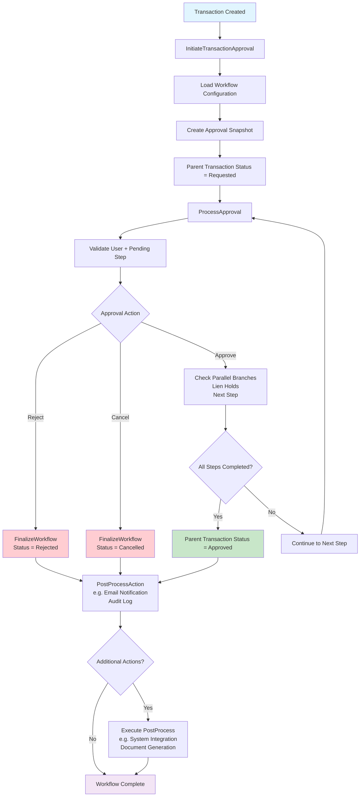

To use the same reusable view (comprising `Approval.cshtml`, `_Notification.cshtml`, `_PendingApprovals.cshtml`, `_ApprovalHistory.cshtml`, and `approval-workflow.js`) across multiple ASP.NET MVC solutions, you need to ensure modularity, portability, and compatibility. Below, I'll outline strategies to achieve this, addressing how to share the UI components, handle backend integration, and maintain consistency across different solutions. I'll then update the Markdown file to include a section on reusing the view across multiple solutions, incorporating these strategies while keeping the content aligned with the provided flowchart and existing implementation.

## Strategies for Reusing Views Across Multiple Solutions

1. **Create a Shared Library for Views**:
   - Package the views and JavaScript as a shared library (e.g., a separate class library or NuGet package) to reference in multiple solutions.
   - Use **AreaRegistration** or **embedded resources** to include views in the library.
   - Alternative: Use a shared folder in source control (e.g., Git submodule or shared directory) accessible to all solutions.

2. **Standardize Models**:
   - Define common models (`ApprovalModel`, `NotificationViewModel`, `PendingApprovalsViewModel`, `ApprovalHistoryViewModel`) in a shared class library.
   - Ensure all solutions reference this library to maintain model consistency.

3. **Modular JavaScript**:
   - Keep `approval-workflow.js` as a standalone file, included via a CDN, shared folder, or NuGet package.
   - Parameterize the JavaScript to accept configuration (e.g., endpoint URLs, transaction IDs) for flexibility.

4. **Backend API Standardization**:
   - Define a standard API contract (e.g., `/Approval/{action}` endpoints returning consistent JSON) across solutions.
   - Use dependency injection or configuration to adapt backend services to solution-specific data sources (e.g., different databases).

5. **Layout Compatibility**:
   - Ensure all solutions use a compatible `_Layout.cshtml` with Bootstrap 5, jQuery, and required CSS.
   - Alternatively, make views self-contained by including necessary styles/scripts inline or via a shared asset bundle.

6. **Configuration for Flexibility**:
   - Use configuration settings (e.g., `web.config` or `appsettings.json`) to customize endpoint URLs, roles, or workflow rules per solution.
   - Allow views to adapt to solution-specific data via model properties or JavaScript configuration.

7. **Version Control and Deployment**:
   - Store shared views and scripts in a version-controlled repository (e.g., Git).
   - Use CI/CD pipelines to deploy updates to the shared library across solutions.
   - Consider a NuGet package for views and scripts to manage versioning and dependencies.

8. **Handle Solution-Specific Customizations**:
   - Use partial view overrides or view components to allow solution-specific customizations.
   - Implement extension points in `approval-workflow.js` for custom behaviors (e.g., custom notifications or additional actions).

## Implementation Details

### 1. Shared Library for Views
Create a class library (e.g., `ApprovalWorkflow.Common`) to host shared views and scripts:
- **Directory Structure**:
  ```
  ApprovalWorkflow.Common/
  ├── Views/
  │   ├── Approval/
  │   │   └── Approval.cshtml
  │   ├── Shared/
  │   │   ├── _Notification.cshtml
  │   │   ├── _PendingApprovals.cshtml
  │   │   └── _ApprovalHistory.cshtml
  ├── Scripts/
  │   └── approval-workflow.js
  ├── Models/
  │   └── ApprovalModels.cs
  ```
- **Embedding Views**:
  - Set `.cshtml` files as **Embedded Resources** in the project file.
  - Use a custom `VirtualPathProvider` or `RazorViewEngine` to load views from the library (example below).
- **NuGet Packaging**:
  - Package the library as a NuGet package with views, scripts, and models.
  - Install the package in each solution using `Install-Package ApprovalWorkflow.Common`.

### 2. Custom View Engine for Embedded Views
Register a custom view engine to load embedded views from the shared library:

```csharp
using System.Web.Mvc;

namespace ApprovalWorkflow.Common
{
    public class CustomViewEngine : RazorViewEngine
    {
        public CustomViewEngine()
        {
            ViewLocationFormats = new[]
            {
                "~/Views/{1}/{0}.cshtml",
                "~/Views/Shared/{0}.cshtml",
                "ApprovalWorkflow.Common.Views.{1}.{0}, ApprovalWorkflow.Common",
                "ApprovalWorkflow.Common.Views.Shared.{0}, ApprovalWorkflow.Common"
            };
        }
    }
}
```

Register in `Global.asax.cs`:

```csharp
protected void Application_Start()
{
    AreaRegistration.RegisterAllAreas();
    RouteConfig.RegisterRoutes(RouteTable.Routes);
    ViewEngines.Engines.Clear();
    ViewEngines.Engines.Add(new CustomViewEngine());
}
```

### 3. Shared Models
Move `ApprovalModel`, `NotificationViewModel`, `PendingApprovalsViewModel`, `ApprovalHistoryViewModel`, `TransactionContext`, `ApprovalRecord`, `HistoryRecord`, and `Transaction` to `ApprovalWorkflow.Common/Models/ApprovalModels.cs`. Reference this library in each solution.

### 4. JavaScript Configuration
Modify `approval-workflow.js` to accept configuration for solution-specific endpoints:

```javascript
const ApprovalWorkflow = (function () {
    let transactionId;
    let config = {
        baseUrl: '/Approval' // Default, override via init
    };

    function init(id, customConfig) {
        transactionId = id;
        config = { ...config, ...customConfig };
        setupEventListeners();
    }

    function performAction(action, transactionId, approvalId) {
        showSpinner();
        $.ajax({
            url: `${config.baseUrl}/${action}`,
            type: 'POST',
            data: { transactionId: transactionId, approvalRecordId: approvalId },
            // ... rest of the function
        });
    }

    // ... rest of the existing code
})();
```

Initialize in `Approval.cshtml`:

```cshtml
@section Scripts {
    <script src="~/Scripts/approval-workflow.js"></script>
    <script>
        ApprovalWorkflow.init('@Model.TransactionId', { baseUrl: '@Url.Content("~/Approval")' });
    </script>
}
```

### 5. Backend API Contract
Define a standard JSON response for all solutions:

```json
{
  "success": boolean,
  "message": string,
  "messageClass": string,
  "approvalStatus": string,
  "statusBadgeClass": string,
  "pendingApprovals": [
    {
      "id": int,
      "approverRole": string,
      "order": int,
      "status": string,
      "canAct": boolean,
      "isParallel": boolean
    }
  ],
  "approvalHistory": [
    {
      "approverName": string,
      "actionType": string,
      "timestamp": string
    }
  ],
  "canCancel": boolean,
  "lienHolds": string[]
}
```

Each solution must implement `/Approval/Approve`, `/Approval/Reject`, and `/Approval/Cancel` endpoints returning this structure.

### 6. Solution-Specific Customizations
Allow overriding partial views in each solution by checking for local versions first:

```csharp
// In CustomViewEngine
ViewLocationFormats = new[]
{
    "~/Views/{1}/{0}.cshtml", // Solution-specific override
    "~/Views/Shared/{0}.cshtml",
    "ApprovalWorkflow.Common.Views.{1}.{0}, ApprovalWorkflow.Common",
    "ApprovalWorkflow.Common.Views.Shared.{0}, ApprovalWorkflow.Common"
};
```

For custom JavaScript behavior, extend `ApprovalWorkflow`:

```javascript
ApprovalWorkflow.customize = function (customFunctions) {
    if (customFunctions.showNotification) {
        showNotification = customFunctions.showNotification;
    }
};
```

### 7. Deployment
- **Git Submodule**: Add `ApprovalWorkflow.Common` as a submodule in each solution's repository.
- **NuGet**: Publish `ApprovalWorkflow.Common` as a NuGet package and install in each solution.
- **CI/CD**: Use pipelines (e.g., Azure DevOps, GitHub Actions) to build and deploy the shared library.

## Updated Markdown File

Below is the updated Markdown file with a new section on reusing the views across multiple solutions, incorporating the strategies above.

```markdown
# Approval Workflow System for ASP.NET MVC

This document outlines the implementation of a multi-level approval workflow system for an ASP.NET MVC application using .NET Framework. The system follows a specific flowchart, supports parallel branches, lien holds, and post-process actions (e.g., email notifications, audit logging, document generation). The UI is reusable across multiple solutions through a shared library, partial views, and modular JavaScript. The backend handles dynamic data via AJAX requests, ensuring a seamless user experience.

## Table of Contents
- [Overview](#overview)
- [Flowchart](#flowchart)
- [Backend Implementation](#backend-implementation)
  - [Models](#models)
  - [Controller](#controller)
  - [Service](#service)
- [UI Implementation](#ui-implementation)
  - [Main View (Approval.cshtml)](#main-view-approvalcshtml)
  - [Partial View: Notification (_Notification.cshtml)](#partial-view-notification-_notificationcshtml)
  - [Partial View: Pending Approvals (_PendingApprovals.cshtml)](#partial-view-pending-approvals-_pendingapprovalscshtml)
  - [Partial View: Approval History (_ApprovalHistory.cshtml)](#partial-view-approval-history-_approvalhistorycshtml)
  - [JavaScript (approval-workflow.js)](#javascript-approval-workflowjs)
  - [Layout (_Layout.cshtml)](#layout-_layoutcshtml)
- [Reusing Views Across Multiple Solutions](#reusing-views-across-multiple-solutions)
- [Setup Instructions](#setup-instructions)
- [Testing](#testing)
- [Notes](#notes)

## Overview

The approval workflow system manages a transaction approval process with multiple levels (e.g., Manager, Compliance, Director, CFO), including:
- **Parallel Branches**: Multiple approvers at the same level (e.g., Manager and Compliance).
- **Lien Holds**: Flags indicating additional checks (e.g., "Collateral Check").
- **Post-Process Actions**: Email notifications, audit logging, and document generation.
- **Reusable UI**: Modular partial views and JavaScript for use across multiple solutions.
- **Dynamic Updates**: AJAX-driven UI updates for status, approvals, and history.

The system follows a flowchart that defines the workflow from transaction creation to completion, handling Approve, Reject, and Cancel actions.

## Flowchart

The workflow is based on the following flowchart:



## Backend Implementation

### Models

File: `Models/ApprovalModels.cs`

```csharp
using System;
using System.Collections.Generic;

namespace ApprovalEngineDemo.Models
{
    public class ApprovalModel
    {
        public Guid TransactionId { get; set; }
        public TransactionContext TransactionContext { get; set; }
        public string InitiatorName { get; set; }
        public string ApprovalStatus { get; set; }
        public string StatusBadgeClass { get; set; }
        public List<ApprovalRecord> PendingApprovals { get; set; }
        public List<HistoryRecord> ApprovalHistory { get; set; }
        public bool CanCancel { get; set; }
        public string Message { get; set; }
        public string MessageClass { get; set; }
        public List<string> LienHolds { get; set; }
        public Func<ApprovalRecord, bool> CanUserAct { get; set; }
    }

    public class TransactionContext
    {
        public decimal Amount { get; set; }
        public string Facility { get; set; }
    }

    public class ApprovalRecord
    {
        public int Id { get; set; }
        public string ApproverRole { get; set; }
        public int Order { get; set; }
        public string Status { get; set; } // Pending, Approved, Rejected
        public bool IsParallel { get; set; }
    }

    public class HistoryRecord
    {
        public string ApproverName { get; set; }
        public string ActionType { get; set; }
        public DateTime Timestamp { get; set; }
    }

    public class User
    {
        public string Name { get; set; }
        public List<string> Roles { get; set; }
        public bool IsInitiator { get; set; }
    }

    public class Transaction
    {
        public Guid Id { get; set; }
        public decimal Amount { get; set; }
        public string Facility { get; set; }
        public string InitiatorName { get; set; }
        public string Status { get; set; }
        public List<ApprovalRecord> PendingApprovals { get; set; }
        public List<HistoryRecord> ApprovalHistory { get; set; }
        public List<string> LienHolds { get; set; }
        public string Message { get; set; }
    }

    public class ActionResult
    {
        public bool Success { get; set; }
        public string Message { get; set; }
    }

    public class NotificationViewModel
    {
        public string Message { get; set; }
        public string MessageClass { get; set; }
    }

    public class PendingApprovalsViewModel
    {
        public List<ApprovalRecord> PendingApprovals { get; set; }
        public Guid TransactionId { get; set; }
        public Func<ApprovalRecord, bool> CanUserAct { get; set; }
    }

    public class ApprovalHistoryViewModel
    {
        public List<HistoryRecord> ApprovalHistory { get; set; }
    }
}
```

### Controller

File: `Controllers/ApprovalController.cs`

```csharp
using System;
using System.Collections.Generic;
using System.Linq;
using System.Web.Mvc;
using ApprovalEngineDemo.Models;

namespace ApprovalEngineDemo.Controllers
{
    public class ApprovalController : Controller
    {
        private readonly ApprovalService _approvalService = new ApprovalService();

        // GET: Approval/Details/{transactionId}
        public ActionResult Details(Guid transactionId)
        {
            var transaction = _approvalService.GetTransaction(transactionId);
            if (transaction == null)
            {
                return HttpNotFound();
            }

            var model = CreateApprovalModel(transaction);
            return View(model);
        }

        // POST: Approval/Approve
        [HttpPost]
        public JsonResult Approve(Guid transactionId, int approvalRecordId)
        {
            try
            {
                var user = GetCurrentUser();
                var result = _approvalService.Approve(transactionId, approvalRecordId, user);
                if (result.Success)
                {
                    var transaction = _approvalService.GetTransaction(transactionId);
                    return Json(new
                    {
                        success = true,
                        message = result.Message,
                        messageClass = "alert-success",
                        approvalStatus = transaction.Status,
                        statusBadgeClass = GetBadgeClass(transaction.Status),
                        pendingApprovals = transaction.PendingApprovals.Select(a => new
                        {
                            id = a.Id,
                            approverRole = a.ApproverRole,
                            order = a.Order,
                            status = a.Status,
                            canAct = _approvalService.CanUserAct(transaction, a, user),
                            isParallel = a.IsParallel
                        }).ToList(),
                        approvalHistory = transaction.ApprovalHistory.Select(h => new
                        {
                            approverName = h.ApproverName,
                            actionType = h.ActionType,
                            timestamp = h.Timestamp.ToString("g")
                        }).ToList(),
                        canCancel = _approvalService.CanCancel(transaction, user),
                        lienHolds = transaction.LienHolds
                    });
                }
                return Json(new { success = false, message = result.Message, messageClass = "alert-danger" });
            }
            catch (Exception ex)
            {
                return Json(new { success = false, message = $"Error: {ex.Message}", messageClass = "alert-danger" });
            }
        }

        // POST: Approval/Reject
        [HttpPost]
        public JsonResult Reject(Guid transactionId, int approvalRecordId)
        {
            try
            {
                var user = GetCurrentUser();
                var result = _approvalService.Reject(transactionId, approvalRecordId, user);
                if (result.Success)
                {
                    var transaction = _approvalService.GetTransaction(transactionId);
                    return Json(new
                    {
                        success = true,
                        message = result.Message,
                        messageClass = "alert-success",
                        approvalStatus = transaction.Status,
                        statusBadgeClass = GetBadgeClass(transaction.Status),
                        pendingApprovals = transaction.PendingApprovals.Select(a => new
                        {
                            id = a.Id,
                            approverRole = a.ApproverRole,
                            order = a.Order,
                            status = a.Status,
                            canAct = _approvalService.CanUserAct(transaction, a, user),
                            isParallel = a.IsParallel
                        }).ToList(),
                        approvalHistory = transaction.ApprovalHistory.Select(h => new
                        {
                            approverName = h.ApproverName,
                            actionType = h.ActionType,
                            timestamp = h.Timestamp.ToString("g")
                        }).ToList(),
                        canCancel = _approvalService.CanCancel(transaction, user),
                        lienHolds = transaction.LienHolds
                    });
                }
                return Json(new { success = false, message = result.Message, messageClass = "alert-danger" });
            }
            catch (Exception ex)
            {
                return Json(new { success = false, message = $"Error: {ex.Message}", messageClass = "alert-danger" });
            }
        }

        // POST: Approval/Cancel
        [HttpPost]
        public JsonResult Cancel(Guid transactionId)
        {
            try
            {
                var user = GetCurrentUser();
                var result = _approvalService.Cancel(transactionId, user);
                if (result.Success)
                {
                    var transaction = _approvalService.GetTransaction(transactionId);
                    return Json(new
                    {
                        success = true,
                        message = result.Message,
                        messageClass = "alert-success",
                        approvalStatus = transaction.Status,
                        statusBadgeClass = GetBadgeClass(transaction.Status),
                        pendingApprovals = transaction.PendingApprovals.Select(a => new
                        {
                            id = a.Id,
                            approverRole = a.ApproverRole,
                            order = a.Order,
                            status = a.Status,
                            canAct = _approvalService.CanUserAct(transaction, a, user),
                            isParallel = a.IsParallel
                        }).ToList(),
                        approvalHistory = transaction.ApprovalHistory.Select(h => new
                        {
                            approverName = h.ApproverName,
                            actionType = h.ActionType,
                            timestamp = h.Timestamp.ToString("g")
                        }).ToList(),
                        canCancel = _approvalService.CanCancel(transaction, user),
                        lienHolds = transaction.LienHolds
                    });
                }
                return Json(new { success = false, message = result.Message, messageClass = "alert-danger" });
            }
            catch (Exception ex)
            {
                return Json(new { success = false, message = $"Error: {ex.Message}", messageClass = "alert-danger" });
            }
        }

        private ApprovalModel CreateApprovalModel(Transaction transaction)
        {
            var user = GetCurrentUser();
            return new ApprovalModel
            {
                TransactionId = transaction.Id,
                TransactionContext = new TransactionContext
                {
                    Amount = transaction.Amount,
                    Facility = transaction.Facility
                },
                InitiatorName = transaction.InitiatorName,
                ApprovalStatus = transaction.Status,
                StatusBadgeClass = GetBadgeClass(transaction.Status),
                PendingApprovals = transaction.PendingApprovals,
                ApprovalHistory = transaction.ApprovalHistory,
                CanCancel = _approvalService.CanCancel(transaction, user),
                Message = transaction.Message,
                MessageClass = string.IsNullOrEmpty(transaction.Message) ? "" : "alert-success",
                LienHolds = transaction.LienHolds,
                CanUserAct = approval => _approvalService.CanUserAct(transaction, approval, user)
            };
        }

        private string GetBadgeClass(string status)
        {
            return status switch
            {
                "Requested" => "bg-warning",
                "Approved" => "bg-success",
                "Rejected" => "bg-danger",
                "Cancelled" => "bg-secondary",
                _ => "bg-secondary"
            };
        }

        private User GetCurrentUser()
        {
            // Simulate user from session or authentication
            return new User
            {
                Name = "Alice Manager",
                Roles = new List<string> { "Manager" },
                IsInitiator = true
            };
        }
    }
}
```

### Service

File: `Controllers/ApprovalService.cs`

```csharp
using System;
using System.Collections.Generic;
using System.Linq;
using ApprovalEngineDemo.Models;

namespace ApprovalEngineDemo.Controllers
{
    public class ApprovalService
    {
        private static readonly List<Transaction> Transactions = new List<Transaction>
        {
            new Transaction
            {
                Id = Guid.Parse("123e4567-e89b-12d3-a456-426614174000"),
                Amount = 5000.00m,
                Facility = "Main Branch",
                InitiatorName = "John Doe",
                Status = "Requested",
                PendingApprovals = new List<ApprovalRecord>
                {
                    new ApprovalRecord { Id = 1, ApproverRole = "Manager", Order = 1, Status = "Pending", IsParallel = false },
                    new ApprovalRecord { Id = 2, ApproverRole = "Compliance", Order = 1, Status = "Pending", IsParallel = true },
                    new ApprovalRecord { Id = 3, ApproverRole = "Director", Order = 2, Status = "Pending", IsParallel = false },
                    new ApprovalRecord { Id = 4, ApproverRole = "CFO", Order = 3, Status = "Pending", IsParallel = false }
                },
                ApprovalHistory = new List<HistoryRecord>
                {
                    new HistoryRecord { ApproverName = "John Doe", ActionType = "Initiated", Timestamp = DateTime.Now.AddHours(-2) }
                },
                LienHolds = new List<string> { "Collateral Check" },
                Message = "Transaction is awaiting approval from Manager and Compliance."
            }
        };

        public Transaction GetTransaction(Guid transactionId)
        {
            var transaction = Transactions.FirstOrDefault(t => t.Id == transactionId);
            if (transaction != null)
            {
                transaction.Message = GetCurrentMessage(transaction);
            }
            return transaction;
        }

        public ActionResult Approve(Guid transactionId, int approvalRecordId, User user)
        {
            var transaction = GetTransaction(transactionId);
            if (transaction == null)
                return new ActionResult { Success = false, Message = "Transaction not found." };

            if (transaction.Status != "Requested")
                return new ActionResult { Success = false, Message = "Transaction is not in a requested state." };

            var approval = transaction.PendingApprovals.FirstOrDefault(a => a.Id == approvalRecordId);
            if (approval == null)
                return new ActionResult { Success = false, Message = "Approval record not found." };

            if (!CanUserAct(transaction, approval, user))
                return new ActionResult { Success = false, Message = "User not authorized to approve." };

            approval.Status = "Approved";
            transaction.ApprovalHistory.Add(new HistoryRecord
            {
                ApproverName = user.Name,
                ActionType = "Approved",
                Timestamp = DateTime.Now
            });

            var currentLevel = approval.Order;
            var pendingInCurrentLevel = transaction.PendingApprovals
                .Any(a => a.Order == currentLevel && a.Status == "Pending");
            string message;

            if (!pendingInCurrentLevel)
            {
                var nextApprovals = transaction.PendingApprovals
                    .Where(a => a.Order > currentLevel)
                    .OrderBy(a => a.Order)
                    .ToList();

                if (nextApprovals.Any())
                {
                    var nextLevel = nextApprovals.Min(a => a.Order);
                    var nextRoles = nextApprovals
                        .Where(a => a.Order == nextLevel)
                        .Select(a => a.ApproverRole)
                        .ToList();
                    message = $"Approved by {approval.ApproverRole}. Now pending {string.Join(" and ", nextRoles)}.";
                }
                else
                {
                    transaction.Status = "Approved";
                    message = "All approvals completed. Transaction is approved.";
                    PerformPostProcessActions(transaction);
                }
            }
            else
            {
                var pendingRoles = transaction.PendingApprovals
                    .Where(a => a.Order == currentLevel && a.Status == "Pending")
                    .Select(a => a.ApproverRole)
                    .ToList();
                message = $"Approved by {approval.ApproverRole}. Still pending {string.Join(" and ", pendingRoles)}.";
            }

            if (transaction.LienHolds.Any())
            {
                message += " Lien holds: " + string.Join(", ", transaction.LienHolds);
            }

            transaction.Message = message;
            return new ActionResult { Success = true, Message = message };
        }

        public ActionResult Reject(Guid transactionId, int approvalRecordId, User user)
        {
            var transaction = GetTransaction(transactionId);
            if (transaction == null)
                return new ActionResult { Success = false, Message = "Transaction not found." };

            if (transaction.Status != "Requested")
                return new ActionResult { Success = false, Message = "Transaction is not in a requested state." };

            var approval = transaction.PendingApprovals.FirstOrDefault(a => a.Id == approvalRecordId);
            if (approval == null)
                return new ActionResult { Success = false, Message = "Approval record not found." };

            if (!CanUserAct(transaction, approval, user))
                return new ActionResult { Success = false, Message = "User not authorized to reject." };

            approval.Status = "Rejected";
            transaction.Status = "Rejected";
            transaction.ApprovalHistory.Add(new HistoryRecord
            {
                ApproverName = user.Name,
                ActionType = "Rejected",
                Timestamp = DateTime.Now
            });
            var message = $"Rejected by {approval.ApproverRole}. Workflow stopped.";
            transaction.Message = message;

            PerformPostProcessActions(transaction);
            return new ActionResult { Success = true, Message = message };
        }

        public ActionResult Cancel(Guid transactionId, User user)
        {
            var transaction = GetTransaction(transactionId);
            if (transaction == null)
                return new ActionResult { Success = false, Message = "Transaction not found." };

            if (transaction.Status != "Requested")
                return new ActionResult { Success = false, Message = "Transaction is not in a requested state." };

            if (!CanCancel(transaction, user))
                return new ActionResult { Success = false, Message = "User not authorized to cancel." };

            transaction.Status = "Cancelled";
            transaction.ApprovalHistory.Add(new HistoryRecord
            {
                ApproverName = user.Name,
                ActionType = "Cancelled",
                Timestamp = DateTime.Now
            });
            var message = "Workflow has been cancelled by the initiator.";
            transaction.Message = message;

            PerformPostProcessActions(transaction);
            return new ActionResult { Success = true, Message = message };
        }

        public bool CanUserAct(Transaction transaction, ApprovalRecord approval, User user)
        {
            if (transaction.Status != "Requested")
                return false;

            var currentLevel = transaction.PendingApprovals
                .Where(a => a.Status == "Pending")
                .Min(a => a.Order);

            return user.Roles.Contains(approval.ApproverRole) &&
                   approval.Status == "Pending" &&
                   approval.Order == currentLevel;
        }

        public bool CanCancel(Transaction transaction, User user)
        {
            return user.IsInitiator && transaction.Status == "Requested";
        }

        private void PerformPostProcessActions(Transaction transaction)
        {
            transaction.ApprovalHistory.Add(new HistoryRecord
            {
                ApproverName = "System",
                ActionType = "Email Sent",
                Timestamp = DateTime.Now
            });

            transaction.ApprovalHistory.Add(new HistoryRecord
            {
                ApproverName = "System",
                ActionType = $"Audit Log: {transaction.Status}",
                Timestamp = DateTime.Now
            });

            if (transaction.Status == "Approved")
            {
                transaction.ApprovalHistory.Add(new HistoryRecord
                {
                    ApproverName = "System",
                    ActionType = "Document Generated",
                    Timestamp = DateTime.Now
                });
            }
        }

        private string GetCurrentMessage(Transaction transaction)
        {
            if (transaction.Status != "Requested")
                return transaction.Message;

            var currentLevel = transaction.PendingApprovals
                .Where(a => a.Status == "Pending")
                .Min(a => a.Order);
            var pendingRoles = transaction.PendingApprovals
                .Where(a => a.Order == currentLevel && a.Status == "Pending")
                .Select(a => a.ApproverRole)
                .ToList();
            var message = $"Transaction is awaiting approval from {string.Join(" and ", pendingRoles)}.";
            if (transaction.LienHolds.Any())
            {
                message += " Lien holds: " + string.Join(", ", transaction.LienHolds);
            }
            return message;
        }
    }
}
```

## UI Implementation

### Main View (Approval.cshtml)

File: `Views/Approval/Approval.cshtml`

```cshtml
@model ApprovalEngineDemo.Models.ApprovalModel
@{
    ViewBag.Title = "Approval Workflow";
    Layout = "~/Views/Shared/_Layout.cshtml";
}

<div class="container mt-4">
    <h2>Approval Workflow for Transaction #@Model.TransactionId</h2>

    <!-- Notification Partial -->
    @Html.Partial("_Notification", new NotificationViewModel
    {
        Message = Model.Message,
        MessageClass = Model.MessageClass
    })

    <!-- Loading Spinner -->
    <div class="spinner-overlay" id="spinnerOverlay"></div>
    <div class="spinner-container" id="spinnerContainer">
        <div class="spinner-border text-primary" role="status">
            <span class="visually-hidden">Loading...</span>
        </div>
    </div>

    <!-- Transaction Details -->
    <div class="card mb-4">
        <div class="card-header">
            <h4>Transaction Details</h4>
        </div>
        <div class="card-body">
            <p><strong>Amount:</strong> $@Model.TransactionContext.Amount</p>
            <p><strong>Facility:</strong> @Model.TransactionContext.Facility</p>
            <p><strong>Initiator:</strong> @Model.InitiatorName</p>
            <p>
                <strong>Status:</strong>
                <span id="statusBadge" class="badge @Model.StatusBadgeClass">@Model.ApprovalStatus</span>
            </p>
            @if (Model.LienHolds.Any())
            {
                <p id="lienHolds"><strong>Lien Holds:</strong> @string.Join(", ", Model.LienHolds)</p>
            }
        </div>
    </div>

    <!-- Pending Approvals Partial -->
    @if (Model.PendingApprovals.Any())
    {
        @Html.Partial("_PendingApprovals", new PendingApprovalsViewModel
        {
            PendingApprovals = Model.PendingApprovals,
            TransactionId = Model.TransactionId,
            CanUserAct = Model.CanUserAct
        })
    }

    <!-- Cancel Button -->
    <div id="cancel-button-container">
        @if (Model.CanCancel)
        {
            <button type="button" class="btn btn-warning mb-4" data-action="Cancel" data-transaction-id="@Model.TransactionId">Cancel Workflow</button>
        }
    </div>

    <!-- Approval History Partial -->
    @Html.Partial("_ApprovalHistory", new ApprovalHistoryViewModel
    {
        ApprovalHistory = Model.ApprovalHistory
    })
</div>

@section Scripts {
    <script src="~/Scripts/approval-workflow.js"></script>
    <script>
        ApprovalWorkflow.init('@Model.TransactionId', { baseUrl: '@Url.Content("~/Approval")' });
    </script>
}
```

### Partial View: Notification (_Notification.cshtml)

File: `Views/Shared/_Notification.cshtml`

```cshtml
@model ApprovalEngineDemo.Models.NotificationViewModel
<div id="notification" class="alert @Model.MessageClass alert-dismissible fade show" role="alert" @(string.IsNullOrEmpty(Model.Message) ? "style=display:none;" : "")>
    @Model.Message
    <button type="button" class="btn-close" data-bs-dismiss="alert" aria-label="Close"></button>
</div>
```

### Partial View: Pending Approvals (_PendingApprovals.cshtml)

File: `Views/Shared/_PendingApprovals.cshtml`

```cshtml
@model ApprovalEngineDemo.Models.PendingApprovalsViewModel
<div id="pendingApprovalsCard" class="card mb-4">
    <div class="card-header">
        <h4>Pending Approvals</h4>
    </div>
    <div class="card-body">
        <table class="table table-striped">
            <thead>
                <tr>
                    <th>Approver Role</th>
                    <th>Order</th>
                    <th>Status</th>
                    <th>Action</th>
                </tr>
            </thead>
            <tbody id="pendingTableBody">
                @foreach (var approval in Model.PendingApprovals)
                {
                    <tr>
                        <td>@approval.ApproverRole @(approval.IsParallel ? "(Parallel)" : "")</td>
                        <td>@approval.Order</td>
                        <td><span class="badge @(approval.Status == "Pending" ? "bg-warning" : approval.Status == "Approved" ? "bg-success" : "bg-danger")">@approval.Status</span></td>
                        <td>
                            @if (Model.CanUserAct(approval))
                            {
                                <button type="button" class="btn btn-success btn-sm me-1" data-action="Approve" data-approval-id="@approval.Id" data-transaction-id="@Model.TransactionId">Approve</button>
                                <button type="button" class="btn btn-danger btn-sm" data-action="Reject" data-approval-id="@approval.Id" data-transaction-id="@Model.TransactionId">Reject</button>
                            }
                        </td>
                    </tr>
                }
            </tbody>
        </table>
    </div>
</div>
```

### Partial View: Approval History (_ApprovalHistory.cshtml)

File: `Views/Shared/_ApprovalHistory.cshtml`

```cshtml
@model ApprovalEngineDemo.Models.ApprovalHistoryViewModel
<div class="card mb-4">
    <div class="card-header">
        <h4>
            <a data-bs-toggle="collapse" href="#approvalHistory" role="button" aria-expanded="false" aria-controls="approvalHistory">
                Approval History
            </a>
        </h4>
    </div>
    <div class="collapse" id="approvalHistory">
        <div class="card-body">
            <table class="table table-striped">
                <thead>
                    <tr>
                        <th>Approver</th>
                        <th>Action</th>
                        <th>Date</th>
                    </tr>
                </thead>
                <tbody id="historyTableBody">
                    @foreach (var history in Model.ApprovalHistory)
                    {
                        <tr>
                            <td>@history.ApproverName</td>
                            <td>@history.ActionType</td>
                            <td>@history.Timestamp.ToString("g")</td>
                        </tr>
                    }
                </tbody>
            </table>
        </div>
    </div>
</div>
```

### JavaScript (approval-workflow.js)

File: `Scripts/approval-workflow.js`

```javascript
const ApprovalWorkflow = (function () {
    let transactionId;
    let config = {
        baseUrl: '/Approval'
    };

    function init(id, customConfig) {
        transactionId = id;
        config = { ...config, ...customConfig };
        setupEventListeners();
    }

    function setupEventListeners() {
        $('body').on('click', '[data-action]', function () {
            var button = $(this);
            var action = button.data('action');
            var approvalId = button.data('approval-id');
            performAction(action, transactionId, approvalId);
        });
    }

    function showSpinner() {
        $('#spinnerOverlay').show();
        $('#spinnerContainer').show();
    }

    function hideSpinner() {
        $('#spinnerOverlay').hide();
        $('#spinnerContainer').hide();
    }

    function performAction(action, transactionId, approvalId) {
        showSpinner();
        $.ajax({
            url: `${config.baseUrl}/${action}`,
            type: 'POST',
            data: { transactionId: transactionId, approvalRecordId: approvalId },
            success: function (response) {
                if (response.success) {
                    updateUI(response);
                    showNotification(response.message, response.messageClass || 'alert-success');
                } else {
                    showNotification(response.message || 'An error occurred.', 'alert-danger');
                }
            },
            error: function () {
                showNotification('Request failed. Please try again.', 'alert-danger');
            },
            complete: function () {
                hideSpinner();
            }
        });
    }

    function updateUI(data) {
        $('#statusBadge').text(data.approvalStatus).removeClass().addClass(`badge ${data.statusBadgeClass}`);

        var pendingTbody = $('#pendingTableBody');
        pendingTbody.empty();
        if (data.pendingApprovals && data.pendingApprovals.length > 0) {
            $('#pendingApprovalsCard').show();
            data.pendingApprovals.forEach(function (approval) {
                var row = `<tr>
                    <td>${approval.approverRole}${approval.isParallel ? ' (Parallel)' : ''}</td>
                    <td>${approval.order}</td>
                    <td><span class="badge ${approval.status === 'Pending' ? 'bg-warning' : approval.status === 'Approved' ? 'bg-success' : 'bg-danger'}">${approval.status}</span></td>
                    <td>
                        ${approval.canAct ? `
                            <button type="button" class="btn btn-success btn-sm me-1" data-action="Approve" data-approval-id="${approval.id}" data-transaction-id="${transactionId}">Approve</button>
                            <button type="button" class="btn btn-danger btn-sm" data-action="Reject" data-approval-id="${approval.id}" data-transaction-id="${transactionId}">Reject</button>
                        ` : ''}
                    </td>
                </tr>`;
                pendingTbody.append(row);
            });
        } else {
            $('#pendingApprovalsCard').hide();
        }

        var cancelContainer = $('#cancel-button-container');
        cancelContainer.empty();
        if (data.canCancel) {
            cancelContainer.append(`<button type="button" class="btn btn-warning mb-4" data-action="Cancel" data-transaction-id="${transactionId}">Cancel Workflow</button>`);
        }

        var historyTbody = $('#historyTableBody');
        historyTbody.empty();
        if (data.approvalHistory) {
            data.approvalHistory.forEach(function (history) {
                var row = `<tr>
                    <td>${history.approverName}</td>
                    <td>${history.actionType}</td>
                    <td>${history.timestamp}</td>
                </tr>`;
                historyTbody.append(row);
            });
        }

        var lienHoldsContainer = $('#lienHolds');
        lienHoldsContainer.empty();
        if (data.lienHolds && data.lienHolds.length > 0) {
            lienHoldsContainer.append(`<p><strong>Lien Holds:</strong> ${data.lienHolds.join(', ')}</p>`);
        }
    }

    function showNotification(message, alertClass) {
        var notification = $('#notification');
        notification.removeClass().addClass(`alert ${alertClass} alert-dismissible fade show`);
        notification.html(message + '<button type="button" class="btn-close" data-bs-dismiss="alert" aria-label="Close"></button>');
        notification.show();
        setTimeout(function () {
            notification.alert('close');
        }, 5000);
    }

    return {
        init: init,
        performAction: performAction,
        updateUI: updateUI,
        showNotification: showNotification
    };
})();
```

### Layout (_Layout.cshtml)

File: `Views/Shared/_Layout.cshtml`

```cshtml
<!DOCTYPE html>
<html>
<head>
    <meta charset="utf-8" />
    <meta name="viewport" content="width=device-width, initial-scale=1.0" />
    <title>@ViewBag.Title - Approval Engine Demo</title>
    <link href="https://cdn.jsdelivr.net/npm/bootstrap@5.3.2/dist/css/bootstrap.min.css" rel="stylesheet" integrity="sha384-T3c6CoIi6uLrA9TneNEoa7RxnatzjcDSCmG1MXxSR1GAsXEV/Dwwykc2MPK8M2HN" crossorigin="anonymous">
    <style>
        .spinner-container { display: none; position: fixed; top: 50%; left: 50%; transform: translate(-50%, -50%); z-index: 1000; }
        .spinner-overlay { position: fixed; top: 0; left: 0; width: 100%; height: 100%; background: rgba(0, 0, 0, 0.3); display: none; z-index: 999; }
    </style>
</head>
<body>
    @RenderBody()
    <script src="https://cdn.jsdelivr.net/npm/@popperjs/core@2.11.8/dist/umd/popper.min.js" integrity="sha384-I7E8VVD/ismYTF4hNIPjVp/Zjvgyol6VFvRkX/vR+Vc4jQkC+hVqc2pM8ODewa9r" crossorigin="anonymous"></script>
    <script src="https://cdn.jsdelivr.net/npm/bootstrap@5.3.2/dist/js/bootstrap.min.js" integrity="sha384-BBtl+eGJRgqQAUMxJ7pMwbEyER4l1g+O15P+16Ep7Q9Q+zqX6gSbd85u4mG4QzX+" crossorigin="anonymous"></script>
    <script src="https://code.jquery.com/jquery-3.6.0.min.js"></script>
    @RenderSection("Scripts", required: false)
</body>
</html>
```

## Reusing Views Across Multiple Solutions

To use the approval workflow views across multiple ASP.NET MVC solutions, follow these steps to ensure modularity, portability, and compatibility:

### 1. Create a Shared Library
Package the views, JavaScript, and models in a shared class library (`ApprovalWorkflow.Common`):
- **Directory Structure**:
  ```
  ApprovalWorkflow.Common/
  ├── Views/
  │   ├── Approval/
  │   │   └── Approval.cshtml
  │   ├── Shared/
  │   │   ├── _Notification.cshtml
  │   │   ├── _PendingApprovals.cshtml
  │   │   └── _ApprovalHistory.cshtml
  ├── Scripts/
  │   └── approval-workflow.js
  ├── Models/
  │   └── ApprovalModels.cs
  ```
- **Embedding Views**:
  - Set `.cshtml` files as **Embedded Resources** in the project file.
  - Use a custom view engine to load embedded views:

```csharp
using System.Web.Mvc;

namespace ApprovalWorkflow.Common
{
    public class CustomViewEngine : RazorViewEngine
    {
        public CustomViewEngine()
        {
            ViewLocationFormats = new[]
            {
                "~/Views/{1}/{0}.cshtml",
                "~/Views/Shared/{0}.cshtml",
                "ApprovalWorkflow.Common.Views.{1}.{0}, ApprovalWorkflow.Common",
                "ApprovalWorkflow.Common.Views.Shared.{0}, ApprovalWorkflow.Common"
            };
        }
    }
}
```

Register in `Global.asax.cs`:
```csharp
protected void Application_Start()
{
    AreaRegistration.RegisterAllAreas();
    RouteConfig.RegisterRoutes(RouteTable.Routes);
    ViewEngines.Engines.Clear();
    ViewEngines.Engines.Add(new CustomViewEngine());
}
```

- **NuGet Packaging**:
  - Package as a NuGet package: `dotnet pack ApprovalWorkflow.Common`.
  - Install in each solution: `Install-Package ApprovalWorkflow.Common`.

### 2. Standardize Models
- Move `ApprovalModel`, `NotificationViewModel`, `PendingApprovalsViewModel`, `ApprovalHistoryViewModel`, `TransactionContext`, `ApprovalRecord`, `HistoryRecord`, and `Transaction` to `ApprovalWorkflow.Common/Models/ApprovalModels.cs`.
- Reference the library in each solution's project file.

### 3. Modular JavaScript
- `approval-workflow.js` accepts a configuration object for solution-specific endpoints:
  - Initialize with `ApprovalWorkflow.init(transactionId, { baseUrl: '/CustomApproval' })` for custom endpoints.
- Host `approval-workflow.js` in the shared library or a CDN for reuse.

### 4. Backend API Contract
- Implement `/Approval/Approve`, `/Approval/Reject`, and `/Approval/Cancel` endpoints in each solution, returning:
```json
{
  "success": boolean,
  "message": string,
  "messageClass": string,
  "approvalStatus": string,
  "statusBadgeClass": string,
  "pendingApprovals": [
    {
      "id": int,
      "approverRole": string,
      "order": int,
      "status": string,
      "canAct": boolean,
      "isParallel": boolean
    }
  ],
  "approvalHistory": [
    {
      "approverName": string,
      "actionType": string,
      "timestamp": string
    }
  ],
  "canCancel": boolean,
  "lienHolds": string[]
}
```

### 5. Solution-Specific Customizations
- Override partial views locally in each solution's `Views/Shared` or `Views/Approval` folder.
- Extend JavaScript behavior:
```javascript
ApprovalWorkflow.customize({
    showNotification: function (message, alertClass) {
        // Custom notification logic
        console.log(`Custom: ${message}`);
    }
});
```

### 6. Deployment
- Use a Git submodule or shared repository for `ApprovalWorkflow.Common`.
- Publish as a NuGet package for versioned updates.
- Use CI/CD pipelines to deploy updates to all solutions.

## Setup Instructions

1. **Project Setup**:
   - Create an ASP.NET MVC project named `ApprovalEngineDemo`.
   - Place `ApprovalController.cs` and `ApprovalService.cs` in the `Controllers` folder.
   - Place model classes in the `Models` folder or reference `ApprovalWorkflow.Common`.
   - Place `Approval.cshtml` in `Views/Approval`.
   - Place `_Notification.cshtml`, `_PendingApprovals.cshtml`, and `_ApprovalHistory.cshtml` in `Views/Shared` or use the shared library.
   - Place `approval-workflow.js` in `Scripts` or reference from the shared library.
   - Use the provided `_Layout.cshtml` in `Views/Shared`.

2. **Routing**:
   Configure MVC routing in `Global.asax.cs` or `RouteConfig.cs`:
   ```csharp
   routes.MapRoute(
       name: "Default",
       url: "{controller}/{action}/{id}",
       defaults: new { controller = "Home", action = "Index", id = UrlParameter.Optional }
   );
   ```

3. **Dependencies**:
   - Bootstrap 5, Popper.js, and jQuery are included via CDNs in `_Layout.cshtml`.
   - Ensure internet access for CDNs or host locally.

## Testing

1. **Access the View**:
   - Navigate to `/Approval/Details/123e4567-e89b-12d3-a456-426614174000`.

2. **Test Scenarios**:
   - **As "Alice Manager" (Manager, Initiator)**:
     - See Approve/Reject buttons for Manager and Compliance (parallel, order 1).
     - See Cancel button.
     - Approve Manager: Notification updates to "Still pending Compliance."
     - Approve Compliance: Advances to Director (order 2).
   - **As "Bob Director"**:
     - Modify `GetCurrentUser`: `{ Name = "Bob Director", Roles = new List<string> { "Director" }, IsInitiator = false }`.
     - See buttons only when Director is pending.
   - **As "Carol CFO"**: Approve final level to complete workflow.
   - **Reject or Cancel**: Stops workflow, updates history with post-process actions.
   - **Lien Holds**: Displayed in UI and messages.
   - **Post-Process**: History includes "Email Sent", "Audit Log", and "Document Generated" (for Approved).

3. **Verification Across Solutions**:
   - Test in each solution with different transaction IDs.
   - Ensure consistent UI behavior and API responses.
   - Verify overrides for solution-specific partial views or JavaScript.

## Notes

- **Database**: Replace `ApprovalService.Transactions` with Entity Framework for production.
- **Authentication**: Use ASP.NET Identity for user roles and initiator status.
- **Security**: Add `[ValidateAntiForgeryToken]` to POST actions.
- **Reusability**: The shared library (`ApprovalWorkflow.Common`) and `approval-workflow.js` configuration ensure views are reusable across solutions.
- **Extensibility**: Add custom post-process actions or UI components as needed.

This implementation provides a robust, reusable approval workflow system aligned with the flowchart, supporting dynamic data and modular UI across multiple solutions.
```

### Usage
- Save the content as `ApprovalWorkflow.md`.
- Use a Markdown viewer (e.g., Visual Studio Code, GitHub) to navigate the file.
- Implement the shared library (`ApprovalWorkflow.Common`) as described in the "Reusing Views Across Multiple Solutions" section.
- Reference the library in each solution, configure endpoints, and test thoroughly.

This updated Markdown file includes a comprehensive guide for reusing the views across multiple solutions, maintaining alignment with the flowchart and existing functionality. Let me know if you need help implementing the shared library, setting up NuGet, or adapting the solution for specific requirements!